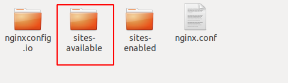

## How to set up

### Install Packages

1. Install Nodejs 

    `sudo apt-get install nodejs`

2. Install npm

    `sudo apt-get install npm`

3. Config Taobao registry

    `npm config set registry https://registry.npm.taobao.org`

4. Update Nodejs

    `npm i -g n`

    `n latest`
    
    Reload cmd shell

5. Install pm2

    `npm i -g pm2`

6. Install Mongodb

    `sudo apt-get install mongodb-server`

8. Install Nginx

    `sudo apt-get install nginx`

9. Install certbot

    `sudo apt install -y nginx certbot python-certbot-nginx`

### Setup 

1.  Restore Database

    `cd src`

    `ls` like this

    

    Then:

    `mongorestore`

2. cd `admin` and `desktop` and `web` and `server` then `npm i` and `npm run build`

    `cd admin`

    `npm i`

    `npm run build`

3. run web in localhost://3000

    `cd server `

    `pm2 index.js`

    vist your server public ip + port3000   
    
    ip:3000

### Config

1. Config Nginx

    [Go Nginx config](http://nginxconfig.io)

2. choose Nodejs

    

3. Domain

    

4. Disable Https

    

5. Download config file

    
6. Extract 

    

7. Cp

    `cp sites-available/ieee-rcar.org.conf /etc/nginx/sites-available/`

    `cd /etc/nginx/sites-avaible`

    `sudo ln -s ../sites-available/ieee-rcar* /etc/nginx/sites-enabled/` 

    !! Change me@example.com to your email

    `sudo certbot --non-interactive --redirect --agree-tos --nginx -d ieee-rcar.org -m me@example.com`

### How to Use admin

> after nginx domain ieee-rcar.org

visit : www.ieee-rcar.org/admin

username : jiang

password : jiang666

